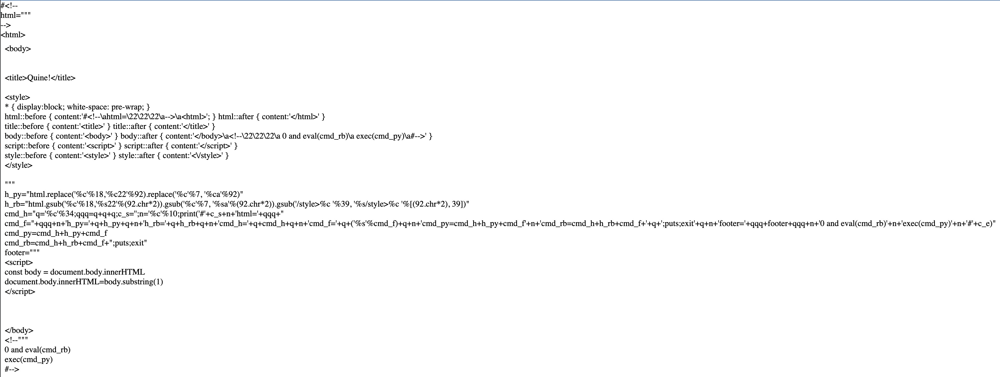

# Polyglot Quines

[Polyglot Program] — is a program that can be executed in multiple languages.
[Quine] — is a program that takes no input and outputs its own source code.
In this project we attempt to write polyglot quines: a program has to be a qiune
and be a quine in multiple languages at the same time.

## Ruby as a Secong Language

The approach to write a bilingual quines where ruby is the second langiage can
be quite simple. We start from a quine in a chosen language and gradually
improve it by running in one language after another.

### Go First

Let's start with go. The most straight forward go quine looks as follows:

```go
package main

import "fmt"

func main() {
    var s string
    s = `package main

import "fmt"

func main() {
    s := %c%s%c
    fmt.Printf(s, 96, s, 96)
}
`
    fmt.Printf(s, 96, s, 96)
}
```

We also want to respect go formatting, as it is usually auto-applied.
Now let's try and execute this program in ruby as is. This is what ruby
interpreter sees:

```ruby
package(main())

import("fmt")

func(main() do
    var(s(string()))
    # `` is a method to execute a shell command
    # we will need to either suppress errors or redefine it
    s = `package main

import "fmt"

func main() {
    s := %c%s%c
    fmt.Printf(s, 96, s, 96)
}
`
    fmt.Printf(s, 96, s, 96)
end)
```

There is a lot of undefined methods and/or variables. To make the program run
without errors we'll need to define those. Also we need to somehow escape ruby
code so that when executed in go it doesn't cause errors. To our advantage
literals for comments are different in ruby and go. And if a line starts
with `//;` it will be interpreted as a comment in go and as an empty regex
in ruby that can just continue execution. This program runs without errors
in both: ruby and go:

```go
//;module Polyglot
//;  def main(&block)
//;    block.call if block
//;  end
//;  def package(_); end
//;  def import(_); end
//;  def string; end
//;  def s(_);end
//;  def var(_); end
//;  def `(str); end
//;  def fmt
//;    Class.new do
//;      def Printf(*args); end
//;    end.new
//;  end
//;  def func(_); end
//;end
//;include Polyglot
package main

import "fmt"

func main() {
    var s string
    s = `package main

import "fmt"

func main() {
    var s string
    s = %c%s%c
    fmt.Printf(s, 96, s, 96)
}
`
    fmt.Printf(s, 96, s, 96)
}
```

In several more [steps switching between ruby and go](./steps_go_rb/) we arrive
at a [bilingual quine](./polyglot_go_rb.go) that executes and works as quine
in both ruby and go. The amount of code reuse can be different, depending on how
fluent you are in both of the languages. The easier you want it to be,
the longer quine becomes.

### Kotlin First

Similar to go, kotlin can be tackled with in the same manner. Starting
from a basic quine in kotlin:

```kotlin
fun main() {
    val template = """fun main() {
    val template = ""%c%s%c""
    println(template.format('"', template, '"'))
}"""
    println(template.format('"', template, '"'))
}
```

Let's se how ruby understands this:

```ruby
fun(main() do
    val(template = "" + "fun main() {
    val template = " + "%c%s%c" + "
    println(template.format('" + ', template, ' + "'))
}" + "")
    println(template.format('"', template, '"'))
end)
```

Similar to the previous case [switching between kotlin and ruby](./steps_kt_rb/)
we arrive at a [bilingual quine](./polyglot_kt_rb.kt) for kotlin and ruby.
It was important to pick the right fights to fight. Sometimes obfuscating
quotes is the way to go to not deal with too much replacements.

### Languages with Similarities

We could continue the same approach for javascript (maybe not for python),
but sometimes if you have more similarities between languages it becomes
beneficial to use similarities and then use small difference to diverge
the behaviour.

#### Python

Python is very similar to ruby. One can write code that works identical in both
of them. Using «%» for string formatting works similarly enough that this part
of code can be shared between python and ruby. The only difference is that
«print» doesn't output new line at the end and «puts» is not defined in python.
For that we use the fact that «0» is falsy in python but truthy in ruby:

```python
s="s=%s;print(s %% (('%%c' %% 34) + s + ('%%c' %% 34)));0 and puts";print(s % (('%c' % 34) + s + ('%c' % 34)));0 and puts
```

In this case steps are not informative but the resulting
[bilingual quine](./polyglot_py_rb.py) is quite short.

#### JavaScript

Javascript, unlike python, has «eval» that works the same way as the one
in ruby, so we only need to eval the right string. Using the falsiness
of 0 again:

```js
js = "q = unescape('%22'); console.log('js = ' + q + js + q); console.log('rb = ' + q + rb + q); console.log('0 && eval(rb) && exit'); console.log('eval(js)')"
rb = "q = 34.chr; puts('js = ' + q + js + q); puts('rb = ' + q + rb + q); puts('0 && eval(rb) && exit'); puts('eval(js)'); true"
0 && eval(rb) && exit
eval(js)
```

No steps in this case as it was [written in one attempt](./polyglot_js_rb.js)
while live coding :)

## Three languages

This one was very hard to achieve. Let me illustrate it with an instruction
on how to draw an owl:


For a very good start Jess was able to implement an html quine. It is hard
to verify, because «after» and «before» content can't be selected on a page.
Visually it looks the same if we ignore whitespace.

The way the HTML quine works is by taking advantage of css styling.

`* { display:block; }`
This makes every element on the page visible, even the styles and the title.

`html::before { content:'<html>' }`
`html::after { content:'</html>' }`
This makes the tags themselves show up, by inserting the text of the tags
before each opening tag and after each closing tag. There are other
approaches to showing every tag that are less repetetive, but also less
straightforward. This approach was chosen because it is easy to read and
reason about, if somewhat tedious.

`white-space: pre-wrap`
This style makes the browser respect the white space as it exists in the
code. Usually HTML strips most white space. Using pre-wrap is especially
important for line breaks. Without it, all the styles would be on one
long line.

`style::after { content:'<\/style>' }`
Adding the backslash before the forward slash in the display text for the
closing style tag is neccessary. Without it, we get:
`style::before { content:'<style>' } style::after { content:'`
The closing tag is read incorrectly, and not shown.




For the rest we use the fact that both ruby and python have «#» for comments
and both support multiline strings with slight modifications. A multiline
string from python:

```python
str = """
multi
line
"""
```

Will be interpreted by ruby as:

```ruby
str = "" + "
multi
line
" + ""
```

And to execute we use the same trick with «0» being falsy in python. We have
to use a lot of string addition, because string formatting only works the same
way for one parameter. The resulting quine can be found
in [polyglot.html](./polyglot.html).

## More?

Even though there are a lot of programs out there able to run in more than one
language it has proven to be extremely hard to make a multilanguage code to also
be a quine. Special characters and string literals are constantly getting
in the way. If you can add a forth language — please let us know. Our hopes are
very high with C. It is very potent in being able to run absolutely nonsensical
programs.

<!-- Links -->

[Polyglot Program]: https://en.wikipedia.org/wiki/Polyglot_(computing)
[Quine]: https://en.wikipedia.org/wiki/Quine_(computing)
