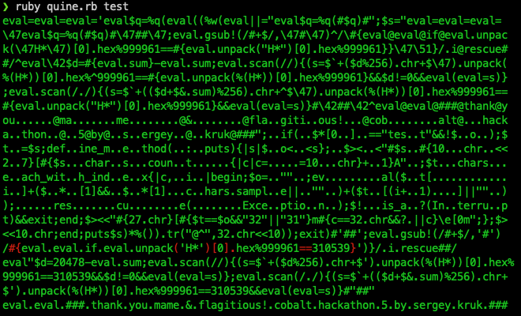

# Mutation-resistant Quine

It's already forth time that quine is in the centre of Code Kata's attention.
Checkout for more insights:

* [Hackathon #3](../2021-10-28-hackathon-3/README.md)
* [Code Kata #3](../2021-11-22-quines/)
* [Hackathon #4](../2022-05-12-hackathon-4/)

This time the goal is to implement a quine that will restore itself if a symbol
of it is deleted or replaced by a different one.

With deletion things are simpler. And there is a good example already of such a
quine. See [radiation-hardened-quine](https://github.com/mame/radiation-hardened-quine)
by Ysuke Endoh. This is definitely a great source of inspiration.

## Usage

To see the quine in action simply run:

```shell
ruby quine.rb
```

You can verify that it indeed is a quine:

```shell
ruby quine.rb | ruby | ruby
# or
ruby quine.rb > tmp.rb
diff quine.rb tmp.rb
```

To test character removal you can try and delete a character in the quine and
run it. Or the quine can test itself:

```shell
ruby quine test
```



The output shows characters can be deleted an the quine still restores itself
(showed in green and space is replaced by «.» for visibility).

Same for mutation. You can either do it manually or supply the test with a pool.
A character from the pool (second argument) will be chosen randomly:

```shell
ruby quine.rb test asdf1234
```

As you can see, neither removal nor mutatation resistance cover the entire
quine. But hey! Pull requests exist for a reason!

## Implementation

There is a couple of ways to approach this. We need some sort of redundancy.
First and more obvious way is duplication. In case of a character removal we can
easily tell that we need to run the emplate that is longer. In case of a mutation
the task becomes a bit harder.

Another way to restore the quine is relying on us knowing what transformation
can occur. Similar to a restoration after removal, suggested by
[flagitious](https://github.com/mame/radiation-hardened-quine/blob/master/flagitious.rb),
we can do (see [restore.rb](./history/restore.rb)):

```ruby
checksum = source.unpack('H*')[0].hex % 900001
sum = source.sum

restored = source.chars.each_with_index.all? do |c, i|
  one_replaced = source[...i] + source.chars.sample + source[(i+1)..]
  found = false
  one_replaced.scan(/./) do
    if ($` + ((sum - one_replaced.sum + $&.sum)%256).chr + $').unpack('H*')[0].hex % 900001 == checksum
      found = true
    end
  end
  found
end
```

Knowing the difference and some sort of a «checksum», we can bruteforce our way
in. The only thing that is left is accounting for the syntax integrity outside
the template.

## Testing and Generation

Initially there was an external [test.rb](./history/test.rb) but nothing stops
us from incorporating the test inside the quine itself.

And of course, none of the quines was actually written by hand. A generator was
there from version one. It is also helpful for using ASCII graphics.
